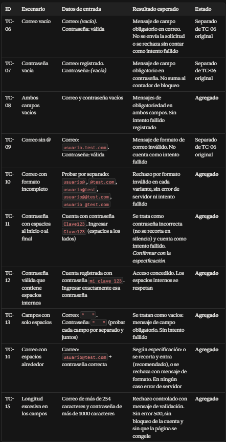

# Bitacora de tecnicas avanzadas

Laboratorio 07: Tecnicas Avanzadas de Prompting.
Herramienta de IA usada: (Claude AI)

## Ejercicio 2: Zero-shot, one-shot y few-shot

| Tipo | Aciertos (de 5) | Formato de la respuesta | Todas con el mismo formato (Sí/No) |
|---|---|---|---|
| Zero-shot | 5 | Tabla ordenada + notas explicativas | No |
| One-shot | 5 | Línea por línea con `->` + explicación corta | No |
| Few-shot | 5 | Exactamente igual al formato de los ejemplos | Sí |

**Diferencia que noté:**
- Con zero-shot, Claude eligió su propio formato y agregó explicaciones extra.
- Con one-shot, ya siguió el ejemplo, pero todavía explicó un poco.
- Con few-shot, copió exactamente el formato que le di, línea por línea, sin nada de más.

## Ejercicio 3: Chain of Thought

| Pedido | Respuesta de la IA | Muestra los pasos (Sí/No) | Correcta (Sí/No) |
|---|---|---|---|
| Directo | 318.60 | No | Sí |
| Paso a paso | 318.60 con todos los cálculos detallados | Sí | Sí |

Por qué es útil ver el razonamiento aunque la respuesta directa haya sido correcta:
Porque si el resultado sale mal, puedo saber exactamente en qué paso se equivocó. También me ayuda a entender cómo llegó a la respuesta y no solo creerle. Al ver los cálculos, compruebo que cada operación esté bien hecha y aprendo cómo se hace.


## Ejercicio 4: Role Prompting

| Versión | Vocabulario (sencillo/técnico) | Usa ejemplos o código | A quién le sirve más |
|---|---|---|---|
| A. Sin rol | Intermedio, claro pero con términos mezclados | Ejemplos en Python | Quien ya conoce lo básico |
| B. Rol docente | Muy sencillo, con analogías como "caja con etiqueta" | Ejemplos muy claros, paso a paso | Quien recién empieza desde cero |
| C. Rol senior | Técnico: tipos, memoria, alcance, buenas prácticas | Código Java con detalles de diseño | Compañeros desarrolladores con experiencia |

**Lo que noté:**
Cambiar el rol cambia totalmente cómo explica las cosas. Como docente usa ejemplos de la vida diaria y evita palabras difíciles. Como desarrollador senior va directo al código y a detalles técnicos. Así puedo pedir la explicación justo al nivel que necesito.

## Ejercicio 5: Descomposición

### Pedido de una sola vez
Al pedirlo todo junto, dio una interfaz visual sencilla con botones y lista de productos. Fue general, sin detalles técnicos ni código.

### Pedido por pasos

**Paso 1 — Requisitos:**
- Gestión de productos (registrar, editar, eliminar)
- Control de stock con validación para no quedar negativo
- Alertas cuando el stock baja del mínimo
- Historial de cada movimiento con fecha y responsable
- Búsqueda por nombre, código, categoría y reportes

**Paso 2 — Diseño de clases:**
Definió las clases: Producto, Categoría, Proveedor, Usuario, MovimientoInventario y ReporteInventario. Con cada atributo y su tipo de dato (int, String, BigDecimal, boolean, etc.).

**Paso 3 — Código de la clase Producto:**
Escribió la clase completa con:
- Atributos privados
- Constructor con todos los datos
- Métodos get y set para cada uno
- Lógica: `tieneStockBajo()` y `toString()`
- Usó `BigDecimal` para los precios

**Paso 4 — Mejoras propuestas:**
1. Validar que no entren valores negativos o vacíos desde el principio
2. Cambiar el set de stock por métodos `aumentarStock()` y `disminuirStock()` con control
3. Agregar `equals()` y `hashCode()` usando el código del producto

### Comparación
Pedirlo todo de una vez dio algo rápido pero muy general. En cambio, dividirlo en partes salió mucho más completo: primero qué necesita, luego cómo se organiza, después el código y al final cómo mejorarlo. Así pude revisar cada paso y pedir que profundice en lo que faltaba.

### 3. Compilar la clase 
- Archivo `Producto.java` creado con el código del Paso 3
- Comando en terminal: `javac Producto.java`
- **Resultado:** Compiló sin errores ni advertencias → se generó `Producto.class`

## Ejercicio 6: Prompt estructurado y autocritica

### 1. Prompt básico
> **Pedido:** Dame casos de prueba para un login.

**Respuesta obtenida:**
La IA entregó una lista muy extensa organizada por categorías: camino feliz, casos negativos, seguridad, límites, usabilidad, compatibilidad y autenticación adicional. Fue general, sin formato de tabla definido ni columnas específicas.

### 2. Prompt estructurado
```text
Actúa como analista de pruebas de software.
Contexto: Login con correo y contraseña. La cuenta se bloquea después de 3 intentos fallidos.
Tarea: Piensa paso a paso qué puede fallar y escribe 6 casos de prueba.
Formato: Tabla con las columnas: ID, escenario, datos de entrada, resultado esperado.
```

### 3. Autocrítica
> **Pedido:** Revisa tu tabla: faltan casos con campos vacíos, contraseña sin @, o contraseña corta? Agrega los que falten e indica cuáles agregaste.

**Casos agregados y separados:**
| ID   | Escenario                              | Estado        |
|------|----------------------------------------|---------------|
| TC-06| Correo vacío                           | Separado      |
| TC-07| Contraseña vacía                       | Agregado      |
| TC-08| Ambos campos vacíos                    | Agregado      |
| TC-09| Correo sin @                           | Separado      |
| TC-10| Correo con formato incompleto          | Agregado      |
| TC-11| Contraseña con espacios                | Agregado      |
| TC-12| Contraseña válida con espacios internos| Agregado      |
| TC-13| Campos con solo espacios               | Agregado      |
| TC-14| Espacios alrededor del correo          | Agregado      |
| TC-15| Longitud excesiva en los campos        | Agregado      |

### 4. Evaluación

| ¿Qué revisar? | Cumple (Sí / No) |
|---|---|
| ¿Tiene las 4 columnas pedidas? | Sí |
| ¿Incluye el bloqueo después de 3 intentos? | Sí |
| ¿Incluye casos con campos vacíos? | Sí |
| ¿Indica qué casos se agregaron en la autocrítica? |  Sí |
| ¿Hay algún caso repetido o que no tenga sentido? |  No, todos son distintos y útiles |

**Observación:**
La IA puede dejar cosas juntas o pasar detalles por alto, incluso cuando ella misma lo escribió. Por eso es importante revisar uno mismo y pedir que complete lo que falta. La máquina ayuda, pero la responsabilidad final es nuestra.

